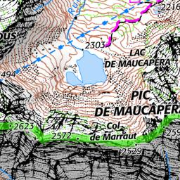

# Carte IGN SCAN25

## Requête à la main

Lancez le script à la main `./gettile.sh` qui permet de récupérer avec le protocole
WMTS/HTTP dans la carte IGN (SCAN25) la tuile `(12061,16388)` au niveau de zoom
15.



Vous pouvez comparer la requête pour l'ancien portail (GeoPortail) et le nouveau (GeoPF).

* nouveau portail : [gettile-geopf.sh](gettile-geopf.sh) (mars 2024)
* ancien portail : [gettile-geoportail.sh](gettile-geoportail.sh)


## Installation de MOBAC

Sous Linux Debian/Ubuntu:

```bash
$ sudo apt install mobile-atlas-creator
$ mobile-atlas-creator &
```
Attention à la version du JRE de Java installée sur votre OS. Pour MOBAC 2.1.4,
j'ai dû installer `openjdk 11.0.22 (2024-01-16)`.

## Ajout des Cartes IGN dans MOBAC

Voici le fichier *Map Source* au format BSH nécessaire pour charger la carte IGN
depuis le portail web (flux WMTS) :

* nouveau portail : [geopf.bsh](geopf.bsh) (mars 2024)
* ancien portail : [geoportail.bsh](geoportail.bsh)

Ajoutez le fichier BSH dans `~/.config/mobac/mapsources/`. Puis sélectionnez
dans *Map Source* la carte souhaitée.


## Annexes

* <http://grimperoots.fr/perso/orel/doku.php?id=test:gettile-geoportail>
* <http://randochartreuse.free.fr/mobac2.x/documentation/#bsh>
* <http://www.grimperoots.fr/j3/index.php/les-crs/divers/490-mobac-offine-mobile-maps>
* <https://geoservices.ign.fr/services-web-issus-des-scans-ign>
* <https://geoservices.ign.fr/actualites/2023-11-20-acces-donnesnonlibres-gpf>

---
