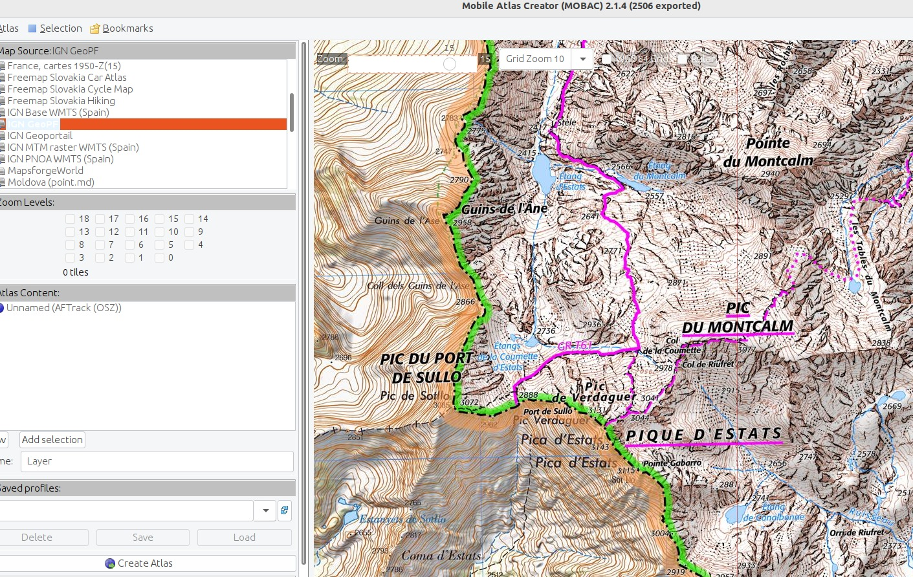

# Carte IGN SCAN25

## Requête à la main

Lancez le script à la main `./gettile.sh` qui permet de récupérer avec le protocole
WMTS/HTTP dans la carte IGN (SCAN25) la tuile `(12061,16388)` au niveau de zoom
15.


Vous pouvez comparer la requête pour l'ancien portail (GeoPortail) et le nouveau (GeoPF).

* nouveau portail : [gettile-geopf.sh](gettile-geopf.sh) (mars 2024)
* ancien portail : [gettile-geoportail.sh](gettile-geoportail.sh)

**Nota Bene:** Le portail IGN est en cours de migration. Le site du *geoportail*
sera bientôt supprimé et définitivement remplacé par *geopf*, qui utilise
actuellement une clé temporaire commune à tout le monde ! Il faudra remplacer
cette clé par sa propre clé dès que le nouveau service web sera complètement
opérationnel.

## Installation de MOBAC

Sous Linux Debian/Ubuntu:

```bash
$ sudo apt install mobile-atlas-creator # version 2.1.4
$ mobile-atlas-creator &
```

Attention à la version du JRE de Java installée sur votre OS. Pour MOBAC
`2.1.4`, j'ai dû installer Java `openjdk 11`. Si besoin, vous pouvez trouver la
dernière version sur <https://sourceforge.net/projects/mobac/>.

## Import des Cartes IGN dans MOBAC

Voici le fichier *Map Source* au format BSH nécessaire pour charger la carte IGN
depuis le portail web (flux WMTS) :

* nouveau portail : [geopf.bsh](geopf.bsh) (mars 2024)
* ancien portail : [geoportail.bsh](geoportail.bsh)

Ajoutez le fichier BSH dans `~/.config/mobac/mapsources/`. Puis sélectionnez
dans *Map Source* la carte souhaitée.



## Génération d'une Carte *offline* avec MOBAC

En pratique, j'utilise l'application *LocusMap* sous Android pour consulter les
cartes IGN *offline*, ce qui est particulièrement utile si on n'a pas de réseau
GSM en montagne !

Pour générer cette carte, il faut créer dans MOBAC un nouvel Atlas au format
(RMAPS sqlite, extension `.sqlitedb`) avec les niveaux de zoom 11/13/15,
correspondant respectivement aux échelles 1:100000/1:50000/1:25000... J'effectue
ensuite dans MOBAC une sélection de la zone d'intérêt, ici les Pyrénées !


Puis, je lance la création de la carte, ce qui peut prendre un temps plus ou
moins long (environ 1h dans ce cas précis).

## Annexes

* <http://grimperoots.fr/perso/orel/doku.php?id=test:gettile-geoportail>
* <http://randochartreuse.free.fr/mobac2.x/documentation/#bsh>
* <http://www.grimperoots.fr/j3/index.php/les-crs/divers/490-mobac-offine-mobile-maps>
* <https://geoservices.ign.fr/services-web-issus-des-scans-ign>
* <https://geoservices.ign.fr/actualites/2023-11-20-acces-donnesnonlibres-gpf>

---
